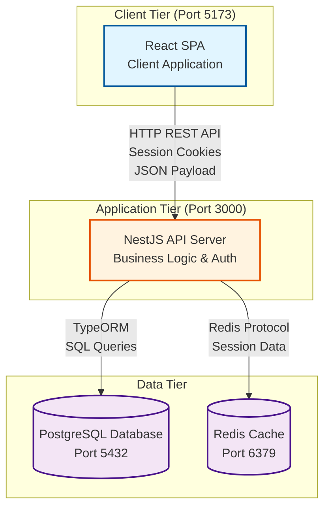
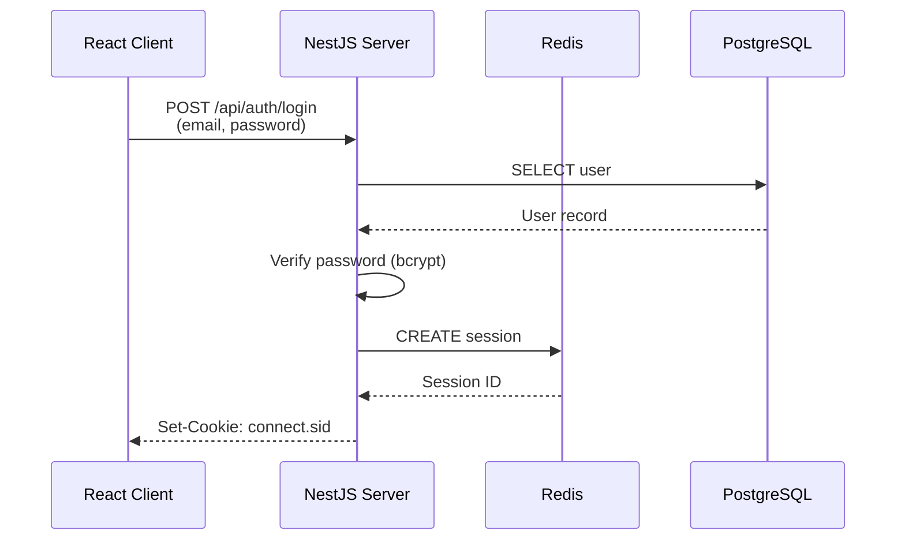
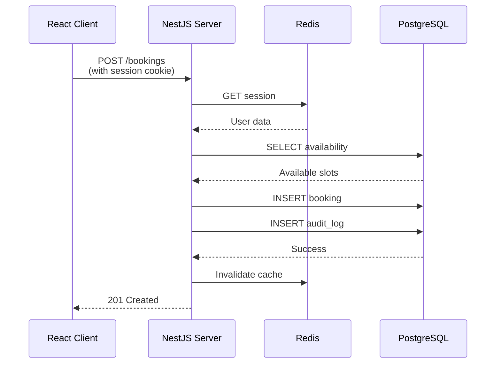

# Component and Connector View

## Client-Server View

```mermaid
graph TB
    subgraph "Client Tier (Port 5173)"
        Client[React SPA<br/>Client Application]
    end

    subgraph "Application Tier (Port 3000)"
        Server[NestJS API Server<br/>Business Logic & Auth]
    end

    subgraph "Data Tier"
        DB[(PostgreSQL Database<br/>Port 5432)]
        Redis[(Redis Cache<br/>Port 6379)]
    end

    Client -->|HTTP REST API<br/>Session Cookies<br/>JSON Payload| Server
    Server -->|TypeORM<br/>SQL Queries| DB
    Server -->|Redis Protocol<br/>Session Data| Redis

    classDef clientStyle fill:#e1f5ff,stroke:#01579b,stroke-width:2px
    classDef serverStyle fill:#fff3e0,stroke:#e65100,stroke-width:2px
    classDef dataStyle fill:#f3e5f5,stroke:#4a148c,stroke-width:2px

    class Client clientStyle
    class Server serverStyle
    class DB,Redis dataStyle
```
## Runtime Behavior

### User Login

```mermaid
sequenceDiagram
    participant Client as React Client
    participant Server as NestJS Server
    participant Redis
    participant DB as PostgreSQL

    Client->>Server: POST /api/auth/login<br/>(email, password)
    Server->>DB: SELECT user
    DB-->>Server: User record
    Server->>Server: Verify password (bcrypt)
    Server->>Redis: CREATE session
    Redis-->>Server: Session ID
    Server-->>Client: Set-Cookie: connect.sid
```

### Creating a Booking

```mermaid
sequenceDiagram
    participant Client as React Client
    participant Server as NestJS Server
    participant Redis
    participant DB as PostgreSQL

    Client->>Server: POST /bookings<br/>(with session cookie)
    Server->>Redis: GET session
    Redis-->>Server: User data
    Server->>DB: SELECT availability
    DB-->>Server: Available slots
    Server->>DB: INSERT booking
    Server->>DB: INSERT audit_log
    DB-->>Server: Success
    Server->>Redis: Invalidate cache
    Server-->>Client: 201 Created
```
