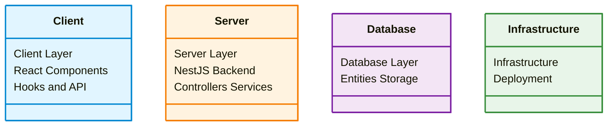

## Module View (UML Component Diagram)

### Legend

```mermaid
classDiagram
    class Client:::clientLayer {
        Client Layer
        React Components
        Hooks and API
    }
    class Server:::serverLayer {
        Server Layer
        NestJS Backend
        Controllers Services
    }
    class Database:::databaseLayer {
        Database Layer
        Entities Storage
    }
    class Infrastructure:::infraLayer {
        Infrastructure
        Deployment
    }

    classDef clientLayer fill:#e1f5ff,stroke:#0288d1,stroke-width:2px
    classDef serverLayer fill:#fff3e0,stroke:#f57c00,stroke-width:2px
    classDef databaseLayer fill:#f3e5f5,stroke:#7b1fa2,stroke-width:2px
    classDef infraLayer fill:#e8f5e9,stroke:#388e3c,stroke-width:2px
```

### Architecture Diagram

```mermaid
classDiagram
    direction TB

    class App:::clientLayer {
        ReactRouter
        AuthProvider
        BrowserRouter
        Routes
    }

    class LoginPage:::clientLayer {
        login()
        FormValidation
        ErrorHandling
    }

    class BookingPage:::clientLayer {
        RoomFilters
        AvailabilityDisplay
        BookingCreation
        TimeSelection
    }

    class SchedulePage:::clientLayer {
        ScheduleView
        BuildingFilter
        DateSelection
        RoomAvailability
    }

    class HistoryPage:::clientLayer {
        BookingHistory
        cancelBooking()
        UserBookings
        AllBookingsAdmin
    }

    class UsersPage:::clientLayer {
        UserManagement
        AddEditUsers
        RoleManagement
        deleteUser()
    }

    class AdminConsole:::clientLayer {
        AuditLogs
        SystemHealth
        BuildingsRooms
        EquipmentManagement
    }

    class AuthContext:::clientLayer {
        login()
        logout()
        SessionManagement
        RoleValidation
        UserState
    }

    class useRooms:::clientLayer {
        fetchRooms()
        FilterManagement
        LoadingStates
    }

    class useSchedule:::clientLayer {
        fetchSchedule()
        AvailabilityQueries
        BuildingAggregation
    }

    class useBookingHistory:::clientLayer {
        createBooking()
        fetchUserBookings()
        cancelBooking()
        OptimisticUpdates
    }

    class useUsers:::clientLayer {
        fetchUsers()
        createUser()
        updateUser()
        deleteUser()
    }

    class useEquipment:::clientLayer {
        fetchEquipment()
        createEquipment()
        updateEquipment()
        deleteEquipment()
    }

    class useAuditLogs:::clientLayer {
        fetchAuditLogs()
        FilterManagement
    }

    class bookings:::clientLayer {
        createBooking()
        fetchUserBookings()
        cancelBooking()
        HTTPRequests
    }

    class schedule:::clientLayer {
        fetchSchedule()
        fetchRooms()
        HTTPRequests
    }

    class rooms:::clientLayer {
        fetchRooms()
        createRoom()
        updateRoom()
        deleteRoom()
    }

    class buildings:::clientLayer {
        fetchBuildings()
        createBuilding()
        updateBuilding()
        deleteBuilding()
    }

    class equipment:::clientLayer {
        fetchEquipment()
        createEquipment()
        updateEquipment()
        deleteEquipment()
    }

    class AppModule:::serverLayer {
        NestJSFramework
        TypeORMIntegration
        SessionMiddleware
        SwaggerDocs
    }

    class AuthModule:::serverLayer {
        SessionManagement
        PasswordHashing
        AuthGuard
        RolesGuard
    }

    class AuthController:::serverLayer {
        POSTlogin
        GETsession
        POSTlogout
        validateUser()
    }

    class UsersController:::serverLayer {
        GETusers
        POSTusers
        PATCHusers
        DELETEusers
        RoleManagement
    }

    class BookingsController:::serverLayer {
        GETbookings
        POSTbookings
        PATCHbookings
        DELETEbookings
        ConflictResolution
    }

    class RoomsController:::serverLayer {
        GETrooms
        POSTrooms
        PATCHrooms
        DELETErooms
        FilteringLogic
    }

    class ScheduleController:::serverLayer {
        GETschedule
        AvailabilityQueries
        TimeSlotManagement
        BuildingAggregation
    }

    class BuildingsController:::serverLayer {
        GETbuildings
        POSTbuildings
        PATCHbuildings
        DELETEbuildings
    }

    class EquipmentController:::serverLayer {
        GETequipment
        POSTequipment
        PATCHequipment
        DELETEequipment
    }

    class RoomEquipmentController:::serverLayer {
        POSTroomequipment
        PATCHroomequipment
        DELETEroomequipment
    }

    class AuditLogsController:::serverLayer {
        GETauditlogs
        AuditTrail
        SystemMonitoring
    }

    class AuthService:::serverLayer {
        validateUser()
        login()
        getSession()
        PasswordComparison
    }

    class UsersService:::serverLayer {
        create()
        findAll()
        findOne()
        findByEmail()
        update()
        remove()
        PasswordHashing
    }

    class BookingsService:::serverLayer {
        create()
        findAll()
        findOne()
        update()
        remove()
        checkForConflicts()
        validateDuration()
    }

    class RoomsService:::serverLayer {
        getSchedule()
        findAll()
        findOne()
        create()
        update()
        remove()
        AvailabilityCalculation
    }

    class BuildingsService:::serverLayer {
        findAll()
        findOne()
        create()
        update()
        remove()
    }

    class EquipmentService:::serverLayer {
        findAll()
        findOne()
        create()
        update()
        remove()
    }

    class RoomEquipmentService:::serverLayer {
        create()
        update()
        remove()
        findByRoom()
    }

    class AuditLogsService:::serverLayer {
        findAll()
        createAuditLog()
        logApiError()
        UserActivityTracking
    }

    class User:::databaseLayer {
        id: uuid
        email: string
        password_hash: string
        first_name: string
        last_name: string
        role: enum
        created_at: timestamp
        updated_at: timestamp
    }

    class Booking:::databaseLayer {
        id: uuid
        user_id: uuid
        room_id: string
        start_time: timestamp
        end_time: timestamp
        status: enum
        created_at: timestamp
        updated_at: timestamp
    }

    class Room:::databaseLayer {
        room_id: string
        building_short_name: string
        room_number: string
        capacity: number
        room_type: enum
        url: string
        created_at: timestamp
        updated_at: timestamp
    }

    class Building:::databaseLayer {
        short_name: string
        name: string
        created_at: timestamp
        updated_at: timestamp
    }

    class Equipment:::databaseLayer {
        id: uuid
        name: string
        created_at: timestamp
        updated_at: timestamp
    }

    class RoomEquipment:::databaseLayer {
        room_id: string
        equipment_id: uuid
        quantity: number
        created_at: timestamp
        updated_at: timestamp
    }

    class AuditLog:::databaseLayer {
        id: uuid
        user_id: uuid
        action: string
        route: string
        query: jsonb
        body: jsonb
        created_at: timestamp
        updated_at: timestamp
    }

    class PostgreSQL:::infraLayer {
        PrimaryDatabase
        ACIDTransactions
        RelationalData
        Indexing
    }

    class DockerCompose:::infraLayer {
        ContainerOrchestration
        ServiceManagement
        DevelopmentEnvironment
    }

    App *-- LoginPage
    App *-- BookingPage
    App *-- SchedulePage
    App *-- HistoryPage
    App *-- UsersPage
    App *-- AdminConsole
    App *-- AuthContext

    LoginPage ..> AppModule
    AuthContext ..> AppModule

    useRooms ..> schedule
    useRooms ..> rooms
    useSchedule ..> schedule
    useBookingHistory ..> bookings
    useUsers ..> AppModule
    useEquipment ..> equipment
    useAuditLogs ..> AppModule

    BookingPage ..> useRooms
    BookingPage ..> useSchedule
    BookingPage ..> useBookingHistory
    SchedulePage ..> useSchedule
    HistoryPage ..> useBookingHistory
    UsersPage ..> useUsers
    AdminConsole ..> useAuditLogs
    AdminConsole ..> useEquipment

    bookings ..> AppModule
    schedule ..> AppModule
    rooms ..> AppModule
    buildings ..> AppModule
    equipment ..> AppModule

    AppModule *-- AuthModule
    AppModule *-- AuthController
    AppModule *-- UsersController
    AppModule *-- BookingsController
    AppModule *-- RoomsController
    AppModule *-- ScheduleController
    AppModule *-- BuildingsController
    AppModule *-- EquipmentController
    AppModule *-- RoomEquipmentController
    AppModule *-- AuditLogsController

    AuthController ..> AuthService
    UsersController ..> UsersService
    BookingsController ..> BookingsService
    RoomsController ..> RoomsService
    ScheduleController ..> RoomsService
    BuildingsController ..> BuildingsService
    EquipmentController ..> EquipmentService
    RoomEquipmentController ..> RoomEquipmentService
    AuditLogsController ..> AuditLogsService

    AuthModule *-- AuthGuard
    AuthModule *-- RolesGuard

    BookingsController ..> AuthGuard
    RoomsController ..> AuthGuard
    BuildingsController ..> AuthGuard
    BuildingsController ..> RolesGuard
    EquipmentController ..> AuthGuard
    EquipmentController ..> RolesGuard
    RoomEquipmentController ..> AuthGuard
    RoomEquipmentController ..> RolesGuard
    UsersController ..> AuthGuard
    UsersController ..> RolesGuard
    AuditLogsController ..> AuthGuard
    AuditLogsController ..> RolesGuard

    AuthService ..> UsersService
    UsersService ..> User
    BookingsService ..> Booking
    RoomsService ..> Room
    BuildingsService ..> Building
    EquipmentService ..> Equipment
    RoomEquipmentService ..> RoomEquipment
    AuditLogsService ..> AuditLog

    User "1" --> "0..*" Booking
    User "1" --> "0..*" AuditLog
    Room "1" --> "0..*" Booking
    Room "1" --> "0..*" RoomEquipment
    Building "1" --> "0..*" Room
    Equipment "1" --> "0..*" RoomEquipment

    User ..> PostgreSQL
    Booking ..> PostgreSQL
    Room ..> PostgreSQL
    Building ..> PostgreSQL
    Equipment ..> PostgreSQL
    RoomEquipment ..> PostgreSQL
    AuditLog ..> PostgreSQL

    DockerCompose ..> App
    DockerCompose ..> AppModule
    DockerCompose ..> PostgreSQL

    classDef clientLayer fill:#e1f5ff,stroke:#0288d1,stroke-width:2px
    classDef serverLayer fill:#fff3e0,stroke:#f57c00,stroke-width:2px
    classDef databaseLayer fill:#f3e5f5,stroke:#7b1fa2,stroke-width:2px
    classDef infraLayer fill:#e8f5e9,stroke:#388e3c,stroke-width:2px
```
