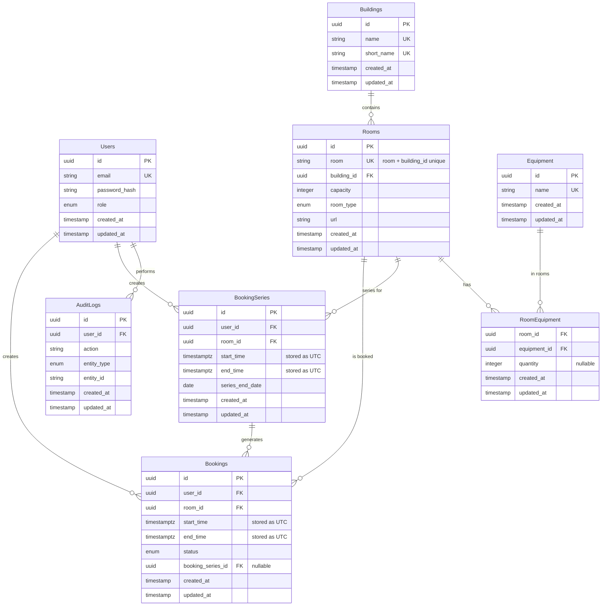

**Constraints**
- `start_time < end_time` (Bookings, BookingSeries)
- `series_end_date >= DATE(start_time)` (BookingSeries)

**Enum Values**
- `role`: Staff, Registrar, Admin
- `status`: Active, Cancelled  
- `room_type`: Classroom, Lecture theatre, Multi-access classroom, Flury Hall, Unknown, David Lam Auditorium
- `entity_type`: User, Building, Room, Equipment, RoomEquipment, Booking, BookingSeries