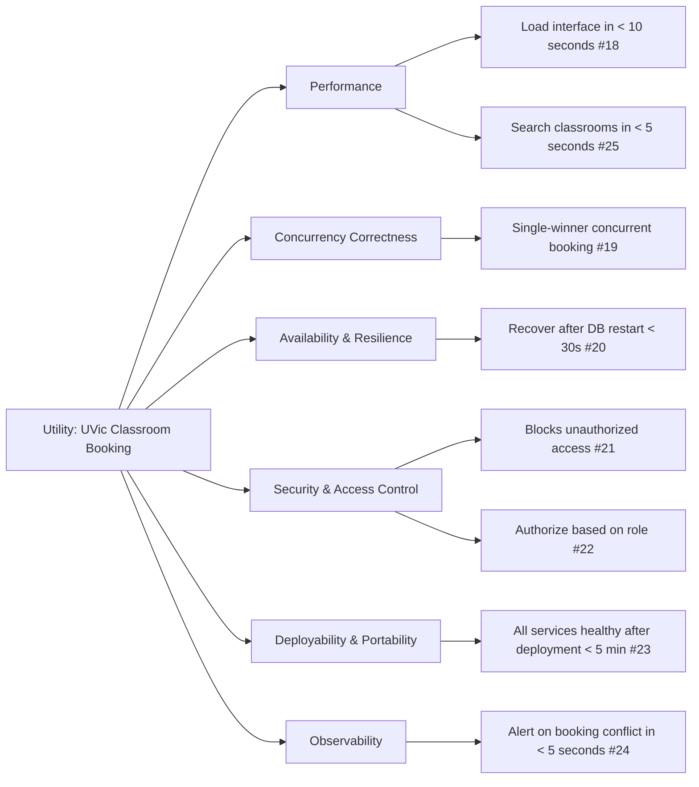

Product Requirements Document
=====

[TOC]

## Overview
This product is a room scheduling system and is being built for the University of Victoria to replace the tedious task of manually booking on-campus rooms. It will function as a web app that enables staff to view, book, and cancel their bookings of rooms. Admin users will be able to view audit records and health. Along with general staff and admin, the registrar will be able to manage and maintain the scheduling and user accounts. This application will streamline the booking process.

## Objectives & Goals

The university currently schedules classrooms manually, which slows reservations and creates uncertainty when multiple people request the same space. This system requires staff to wait for approval even for routine bookings, leading to delays and inefficient use of limited classroom space. An updated system could eliminate this bottleneck by giving staff direct access to real-time availability and immediate booking confirmation.

This project will shift classroom bookings to a web-based self-service product. The system will process booking requests instantly without the need for manual review. When conflicts occur for the same room and time, one booking succeeds and the other gets immediate notification of failure, preventing double bookings. Staff need the ability to cancel reservations when plans change so rooms become available for others to book. The system will display availability based on classroom and time-slot data that the Registrar maintains, ensuring that what users see reflects actual space availability. These features will make classroom booking faster and reduce administrative overhead.

## User Stories
1.  (Issue #11)\
    As a member of staff at the University of Victoria,\
    I want to view the available classrooms at a given time,\
    So that I can choose a classroom that doesn't interfere with other classes. 
2.  (Issue #12)\
    As a member of staff at the University of Victoria,\
    I want to book a classroom at a given time and have it show up for all other staff members,\
    So that no one else takes the classroom/time that I want for my class.
3.  (Issue #13)\
    As a member of staff at the University of Victoria,\
    I want to review and cancel my booking,\
    So that I can reschedule it for another time that works better.
4.  (Issue #14)\
    As a member of staff at the University of Victoria,\
    I want to be able to book a recurring weekly schedule for my class for a given term,\
    So that I avoid the manual task of booking each week separately.
5.  (Issue #15)\
    As a Registrar employee at the University of Victoria,\
    I want the system to only allow one success (and give the other a failure message) when two people try to book a room's time slot at the same time\
    So that I don't have to manually resolve double bookings
6.  (Issue #16)\
    As a Registrar employee of the University of Victoria,\
    I want to be able to have control over the bookings as a whole and overwrite any bookings if needed,\
    So that I can resolve scheduling issues if they arise.
7.  (Issue #17)\
    As an administrator at the University of Victoria,\
    I want to view configuration constraints, audit records and health of the system,\
    So that I can ensure everything is functioning as expected, and notify the IT team if there are any issues.

## Functional Requirements
1. Staff can book rooms in 1 click - Issue [issue:1]
2. If 2 people book rooms at the same time one gets an error message - Issue [issue:2]
3. The System must support staff, registrar and admins - Issue [issue:3]
4. The system must support cancelation, rollback and undo - Issue [issue:4]
5. The System has to be fully integrated to Docker - Issue [issue:5]
6. The admin role must be fully supported - Issue [issue:6]
7. The registrar role must be fully supported - Issue [issue:7]
8. The system must include a sign-in page- Issue [issue:8]
9. The system must allow users to book rooms for up to 1 week in the future - Issue [issue:9]
10. The system must allow for the length of bookings to be changed - Issue [issue:10]

## Quality Attribute Requirements

Linked Issues: QA1: #18, QA2: #25, QA3: #19, QA4: #20, QA5: #21, QA6: #22, QA7: #23, QA8: #24.

## Milestones & Deliverables
The development group plans to manage time spent on the project by estimating the time to implement each issue. Then it will be assigned based on the skills needed and who has availability to work on each one. Once the work has been assigned accordingly, the group plans to attend lab sessions to update other group members on progress and/or blockers as well as meet outside of classtime when needed to futher coordinate work and discuss implementation (about once a week).\
**Milestone 1** - %"Design I": This PRD, our test plan, our ADRs and our GenAI prompts file.\
**Milestone 2** - %"Implementation I": Implementing user stories, functional requirements, and quality attributes.\
**Milestone 3** - %"Design II": Improve and retrospect design based on feedback and design two or more advanced capabilities.\
**Milestone 4** - %"Implementation II": Implement design improvements and two or more advanced capabilities.\
**Milestone 5** - %"Refactoring": Make changes to another group's code to adapt it.\
**Milestone 6** - %"Reflection and Presentation": Create slides and answer questions about the project and the use of AI.
