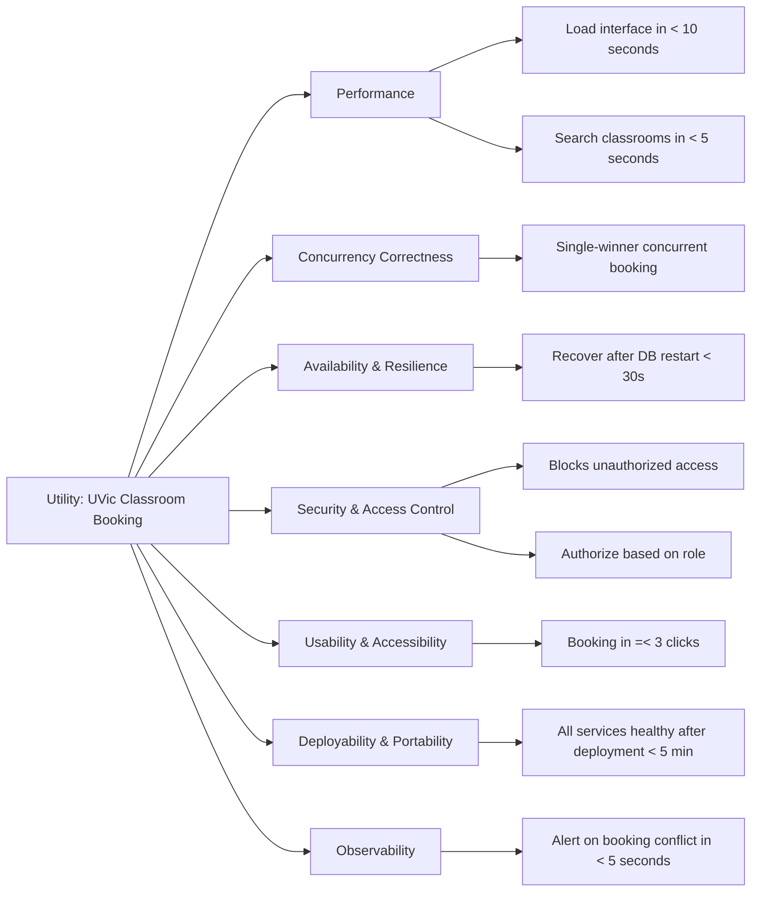

```mermaid
graph LR;
  U[Utility: UVic Classroom Booking] --> P[Performance];
  U --> CC[Concurrency Correctness];
  U --> AV[Availability & Resilience];
  U --> SEC[Security & Access Control];
  U --> UX[Usability & Accessibility];
  U --> DEP[Deployability & Portability];
  U --> OBS[Observability];

  P --> P1[Load interface in < 10 seconds];
  P --> P2[Search classrooms in < 5 seconds];
  CC --> CC1[Single-winner concurrent booking];
  AV --> AV1[Recover after DB restart < 30s];
  SEC --> SEC1[Blocks unauthorized access];
  SEC --> SEC2[Authorize based on role];
  UX --> UX1[Booking in =< 3 clicks];
  DEP --> DEP1[All services healthy after deployment < 5 min];
  OBS --> OBS1[Alert on booking conflict in < 5 seconds];
```
