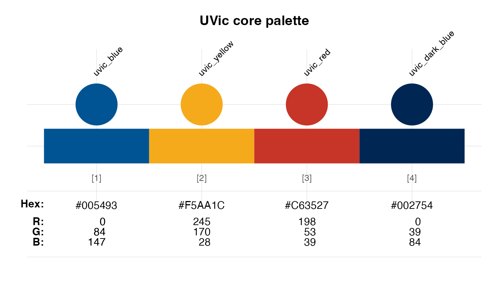

# UVic Core Color Palette

## Color Specifications

| Color Name     | Hex Code  | RGB Values            | Usage                  |
|----------------|-----------|-----------------------|------------------------|
| UVic Blue      | `#005493` | R: 0, G: 84, B: 147   | Primary brand color    |
| UVic Yellow    | `#F5AA1C` | R: 245, G: 170, B: 28 | Secondary accent color |
| UVic Red       | `#C63527` | R: 198, G: 53, B: 39  | Accent color           |
| UVic Dark Blue | `#002754` | R: 0, G: 39, B: 84    | Dark accent/text color |

